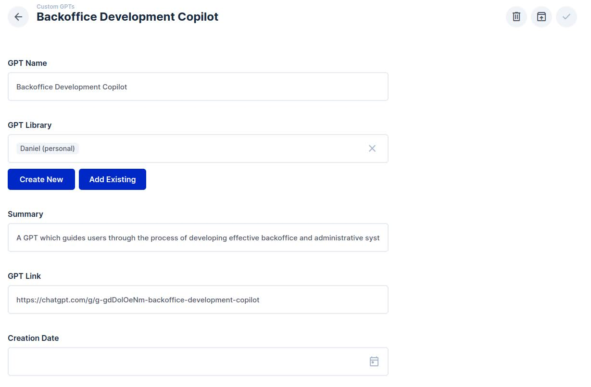
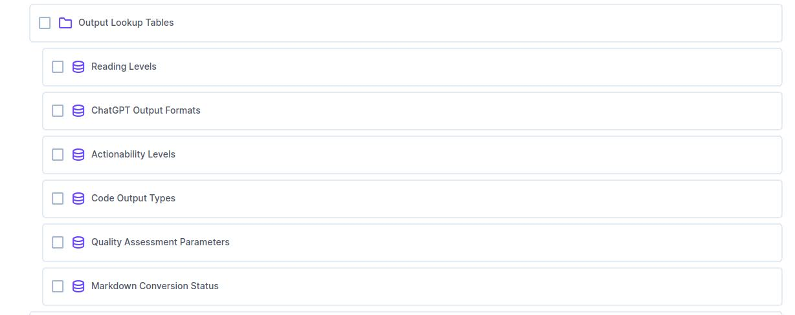
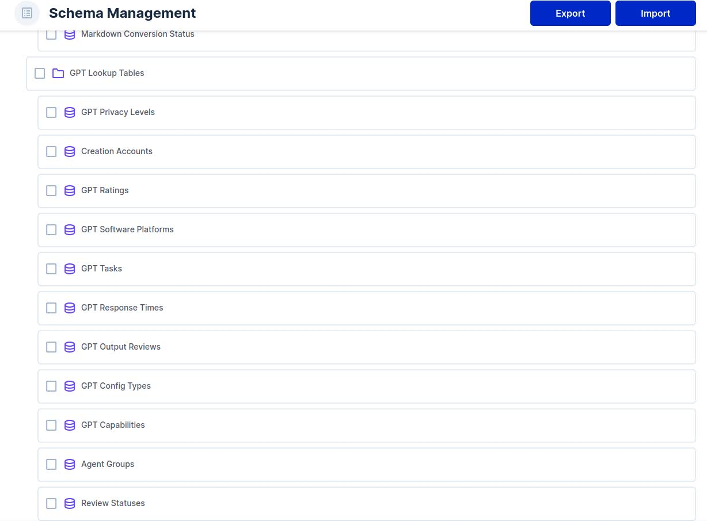
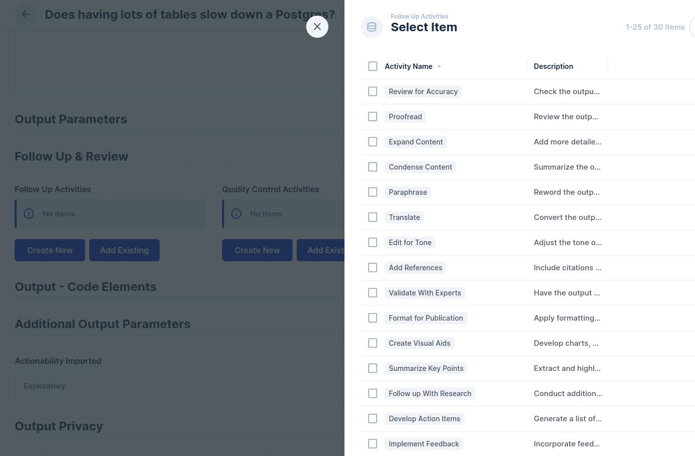
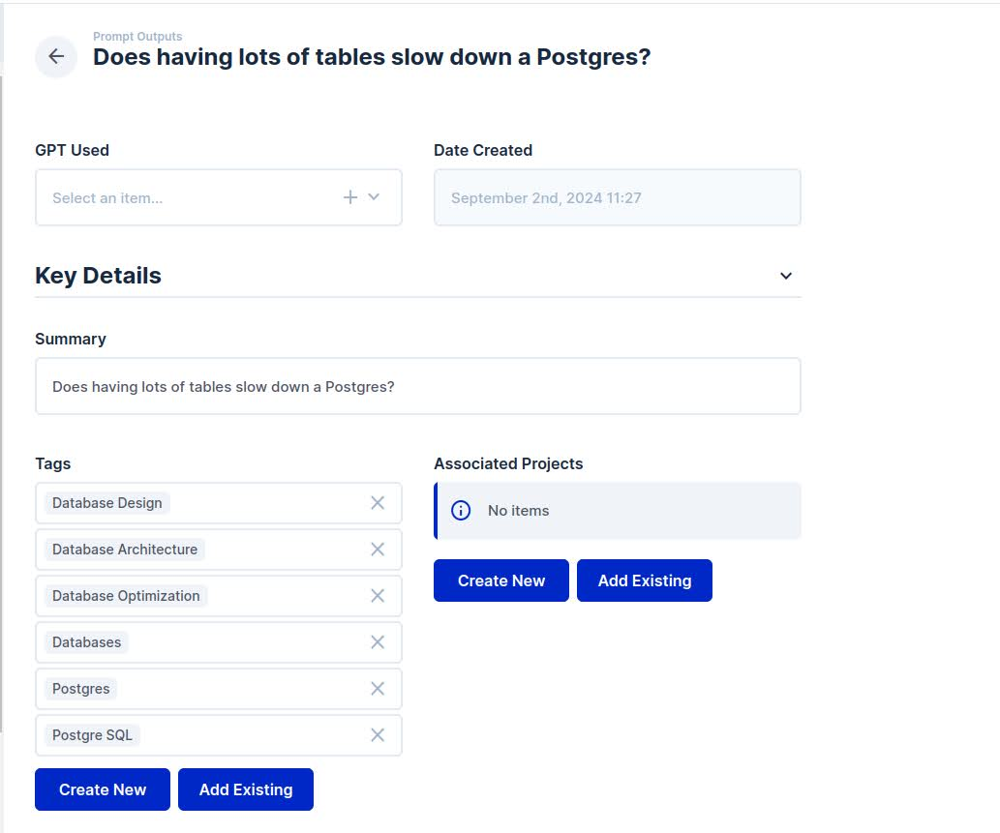

# Frontend / Data Management With Directus (02-Sep-2024)

## Custom GPT Manager

## Lookup Tables, Prompt Library

## Lookup Tables, Prompt Outputs

## Taxonomies

## Database Schema

## Custom GPTs Module, Fields

## Data Model Overview, Directus

## Assigning Follow-Up Tags (To Prompt Output)

## Appending Notes To Prompt Output

## Example Saved Prompt Output

## Selecting Related Custom GPT (Prompt Output Screen)

## Tag Associations (Prompt Output Screen)

